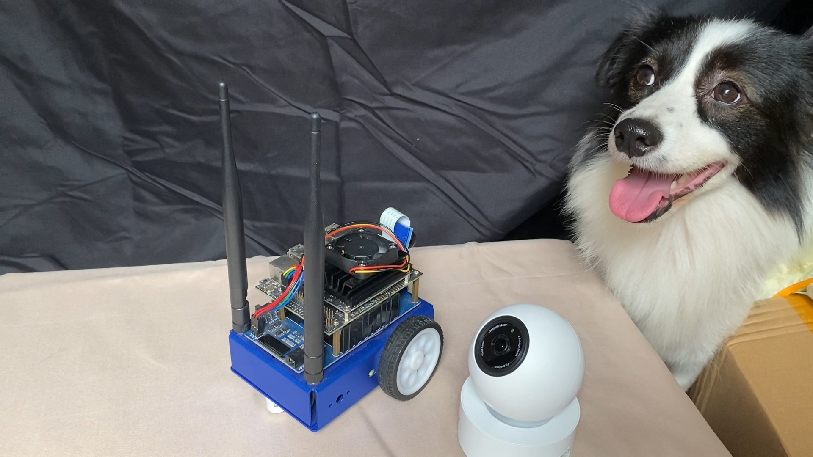

## 家庭宝-智能家居视频分析盒子

### 介绍

请看我的blog：[家庭宝开发进度（202008）- 为什么要做这个](https://ijst.me/wp/2020/08/31/%e5%ae%b6%e5%ba%ad%e5%ae%9d%e5%bc%80%e5%8f%91%e8%bf%9b%e5%ba%a6%ef%bc%88202008%ef%bc%89-%e4%b8%ba%e4%bb%80%e4%b9%88%e8%a6%81%e5%81%9a%e8%bf%99%e4%b8%aa/)

### 代码目录

1. deepstream-fall-detection/ : 里面包含deepstream版本的摔倒检测代码

2. backend/ : 后台管理服务

3. frontend/ : 前端界面

### 硬件展示

左边为我的jetbot机器人，其核心板为jetson nano，我们的运算就靠它了。白色的摄像头能水平、垂直转动，提供rtsp流。最右边的狗狗是本项目的首席代言人（狗？）

### Roadmap

- [x] 算法demo

- [ ] 管理后台
- - [x] 消息事件管理
- - [ ] 告警代码 - *finish before 11th, Sept.*
- - [ ] 微信通知 - *finish before 12th, Sept.*

- [ ] 管理前端界面
- - [ ] 告警记录查看 - *finish before Oct*
- - [ ] 实时画面
- - [ ] 配置界面 - *finish in Oct.*

- [ ] B站视频 - *希望能在国庆期间完成。*

### 如何捐赠或贡献

- 如果您想贡献，可以贡献本项目的代码，让功能更丰富

1. 需要懂前端、UI的朋友帮忙完善前端的页面。
2. 熟悉DeepStream的朋友，需要帮忙实现SmartRecord功能。

- 如果您想捐赠，可以扫下面二维码请我喝杯奶茶咖啡，谢谢。

微信支付

支付宝支付
